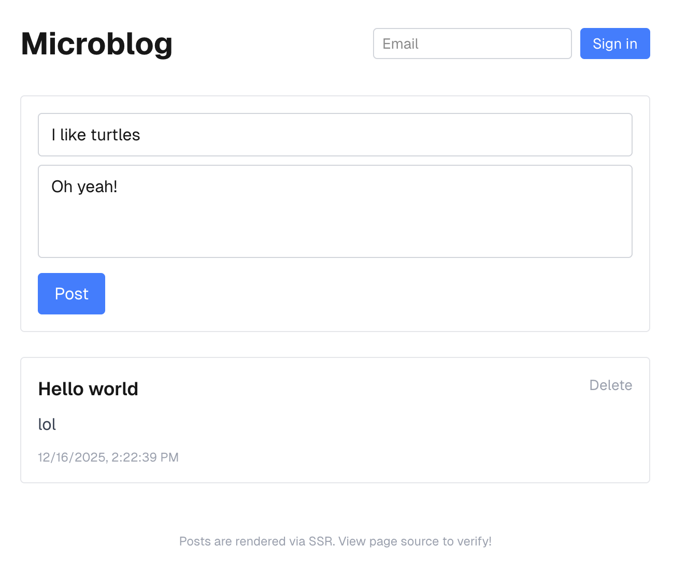

# Instant SSR Demo

A simple microblog demonstrating server-side rendering (SSR) with [InstantDB](https://instantdb.com) and Next.js.



## Getting Started

Instructions for running this project after cloning.

### 1. Install dependencies

```bash
pnpm install
```

### 2. Login to Instant

```bash
pnpx instant-cli login
```

This opens a browser to authenticate with your Instant account.

### 3. Create a new Instant app

```bash
pnpx instant-cli init-without-files --title "My SSR App"
```

This outputs your `APP_ID` and `ADMIN_TOKEN`. Save these for the next step.

### 4. Set up environment variables

Create a `.env` file:

```bash
NEXT_PUBLIC_INSTANT_APP_ID=<your-app-id>
INSTANT_APP_ADMIN_TOKEN=<your-admin-token>
```

### 5. Push the schema

```bash
pnpx instant-cli push schema
```

This pushes the schema defined in `instant.schema.ts` to your new app.

### 6. Run the dev server

```bash
pnpm dev
```

Visit http://localhost:3000 to see the app.

## Verifying SSR

1. Open the page in Chrome
2. Open DevTools (`Cmd+Option+I`)
3. Open Command Menu (`Cmd+Shift+P`)
4. Type "disable javascript" and select it
5. Refresh the page

If SSR is working, you'll still see the content (not a loading state).

## Making an Instant App SSR Compatible

### 1. Create the route handler for cookie sync
```ts
// src/app/api/instant/[...all]/route.ts
import { createInstantRouteHandler } from "@instantdb/react";

export const { GET, POST } = createInstantRouteHandler({
  appId: process.env.NEXT_PUBLIC_INSTANT_APP_ID!,
});
```

### 2. Update db.ts to use the nextjs export
```ts
// src/lib/db.ts (NO "use client" directive)
import { init } from "@instantdb/react/nextjs";
import schema from "../instant.schema";

export const db = init({
  appId: process.env.NEXT_PUBLIC_INSTANT_APP_ID!,
  cookieEndpoint: "/api/instant",
  schema,
});
```

### 3. Create a client provider wrapper
```tsx
// src/InstantProvider.tsx
"use client";
import { InstantSuspenseProvider } from "@instantdb/react/nextjs";
import { db } from "./lib/db";

export const InstantProvider = ({ children, user }) => (
  <InstantSuspenseProvider user={user} db={db}>
    {children}
  </InstantSuspenseProvider>
);
```

### 4. Update layout to read cookie and wrap with provider
```tsx
// src/app/layout.tsx
import { cookies } from "next/headers";
import { InstantProvider } from "@/InstantProvider";

export default async function RootLayout({ children }) {
  const cookieStore = await cookies();
  const userJSON = cookieStore.get("instant_user");
  const user = userJSON ? JSON.parse(userJSON.value) : null;

  return (
    <html><body>
      <InstantProvider user={user}>{children}</InstantProvider>
    </body></html>
  );
}
```

### 5. Use `useSuspenseQuery` in your pages
```tsx
// src/app/page.tsx
"use client";
import { db } from "@/lib/db";

export default function Page() {
  const { data } = db.useSuspenseQuery({ posts: {} });
  // renders on server, no loading state needed
}
```

### Key Points

- **No `<Suspense>` wrapper needed** - the provider handles it internally
- **Cookie sync** - the route handler + `cookieEndpoint` config syncs auth state to cookies so the server can read it

## Questions?

Got any feedback or questions? Join our [Discord](https://discord.gg/hgVf9R6SBm)
